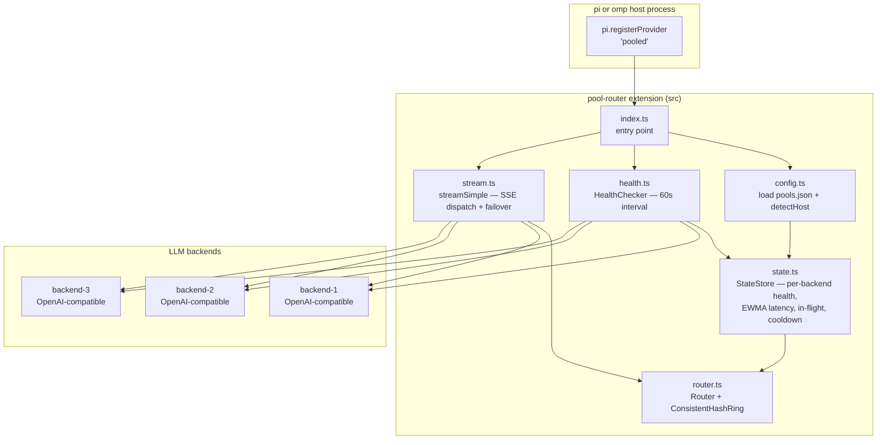
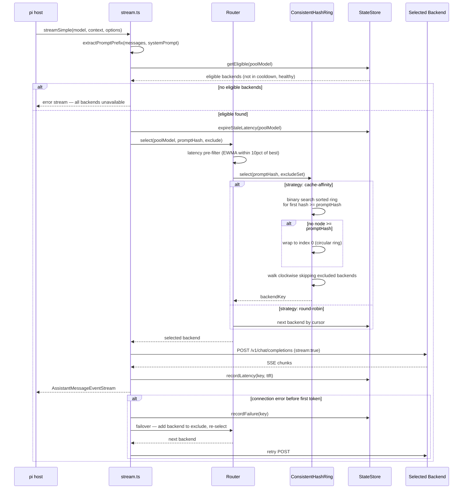
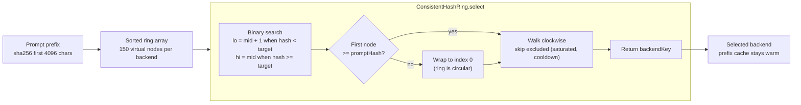
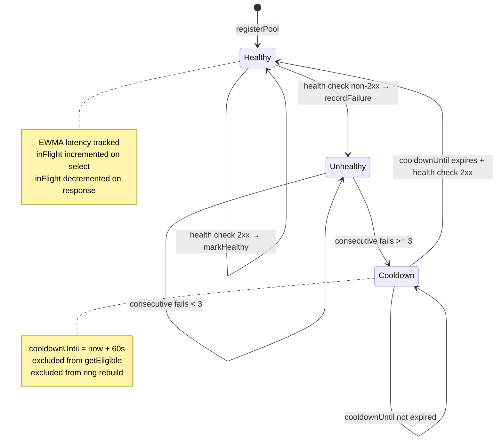
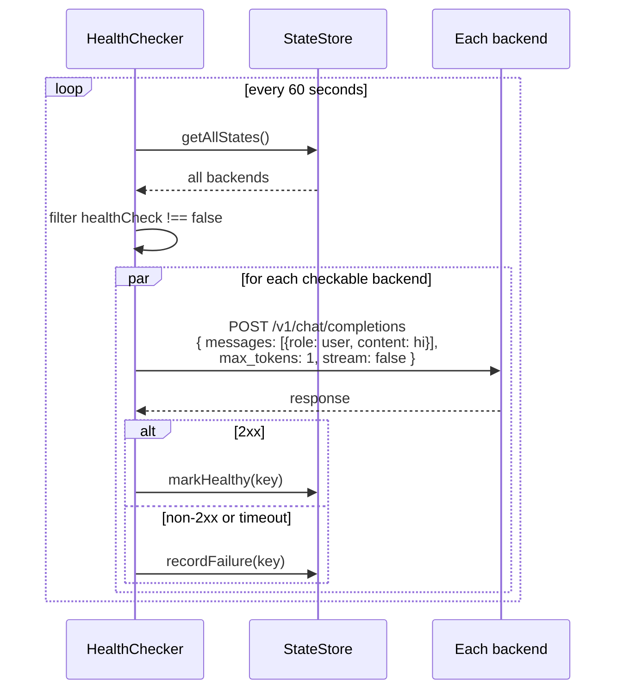
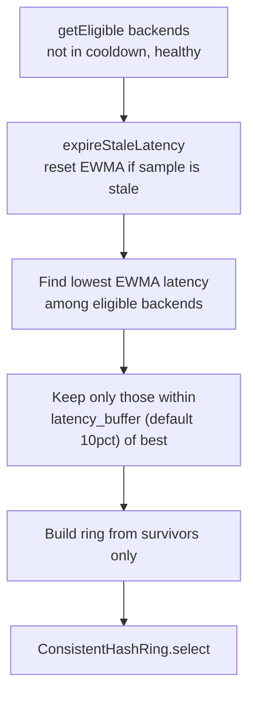
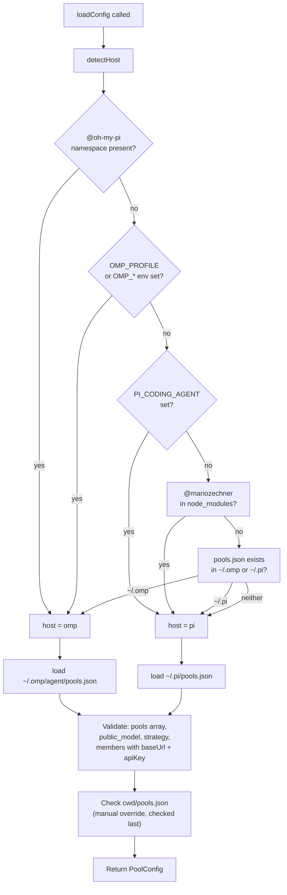

# Pool Router — Architecture

> A pi/omp in-process extension that replaces LiteLLM's pool routing natively. Define pools in a self-contained `pools.json` — the extension registers a custom provider that routes requests across backends using a **cache-affinity hash ring** with a latency pre-filter.

| | |
|---|---|
| **Language** | TypeScript · ES Modules |
| **Runtime** | Node.js 18+ / Bun · runs in-process under pi or omp |
| **Host Detection** | Auto-detects pi vs omp via `@oh-my-pi` namespace, env vars, and dependency layout |
| **Strategies** | `cache-affinity` (default, consistent hash ring) · `round-robin` |
| **Config** | `pools.json` at `~/.pi/pools.json` or `~/.omp/agent/pools.json` |
| **Health Checks** | Background polling every 60s — `max_tokens: 1` probe per backend |

---

## High-Level Architecture

---

## Request Routing — Cache-Affinity Flow

---

## Consistent Hash Ring — Selection Detail

The ring is a sorted array of `sha256` hash positions. Each backend gets 150 virtual nodes for even distribution. "Walking clockwise" = binary search for the first position >= the prompt hash, then scan forward skipping excluded backends.

**Why consistent?** When a backend goes down, only its prompts re-map — the rest stay put. Same prompt always hashes to the same position, so the same backend is selected (cache hit). If that backend is saturated or in cooldown, walk clockwise to the next.

---

## Backend State Machine

---

## Health Check Loop

---

## Latency Pre-Filter

Before the ring runs, backends are filtered by latency to exclude slow or degraded nodes while preserving cache locality among the fast ones.

---

## Configuration Loading

**Host-aware loading** prevents a stray `pools.json` under the other host's directory from shadowing a valid config. Each host loads from its own path first.
